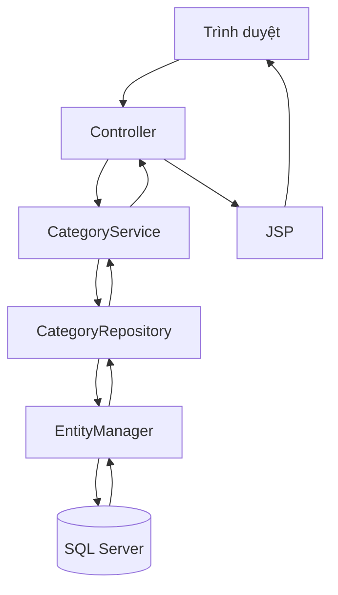

# Servlet CRUD Category bằng JPA

Project đã được chuyển từ JDBC thuần sang **Jakarta Persistence (JPA) + Hibernate + SQL Server**. Giao diện vẫn dùng Servlet, JSP và JSTL như bài CRUD ban đầu.

## 1. Hai yêu cầu đã hoàn thành

### Yêu cầu 1: Cấu hình và test JPA

- Thêm Hibernate ORM và SQL Server JDBC Driver trong `pom.xml`.
- Cấu hình persistence unit `dataSource` trong `src/main/resources/META-INF/persistence.xml`.
- Tạo `JpaConfig` dùng chung một `EntityManagerFactory` trong suốt vòng đời ứng dụng.
- Tạo `JpaConnectionTest` để kiểm tra trực tiếp kết nối SQL Server.
- Tạo `CategoryRepositoryTest` để tự động kiểm tra toàn bộ CRUD bằng H2, không làm thay đổi dữ liệu SQL Server thật.
- Tạo `JpaContextListener` để đóng `EntityManagerFactory` khi Tomcat dừng.

### Yêu cầu 2: CRUD Category bằng JPA

- Create: `EntityManager.persist()`.
- Read: `find()`, NamedQuery và JPQL.
- Update: `EntityManager.merge()`.
- Delete: `find()` rồi `remove()`.
- Search: JPQL với `LIKE`.
- Mọi thao tác ghi đều có `begin`, `commit`, `rollback` và đóng `EntityManager`.

## 2. Công nghệ

| Thành phần | Công nghệ |
|---|---|
| Web server | Tomcat 11 |
| Presentation | Servlet 6.1, JSP, JSTL 3 |
| ORM | Jakarta Persistence, Hibernate ORM 7.4.6.Final |
| Database | Microsoft SQL Server |
| Build | Maven, Java 17 trở lên |
| Test | JUnit 5, H2 Database |

## 3. Cấu trúc project

```text
bt02/
├── database.sql
├── pom.xml
├── README.md
└── src/
    ├── main/
    │   ├── java/vn/iotstar/
    │   │   ├── controllers/    Servlet tiếp nhận request và điều hướng
    │   │   ├── entity/         Entity Category ánh xạ bảng SQL Server
    │   │   ├── models/         Tầng xử lý nghiệp vụ
    │   │   ├── repository/     Tầng truy cập dữ liệu bằng JPA
    │   │   └── utils/          JpaConfig, listener, test kết nối, lưu ảnh
    │   ├── resources/META-INF/
    │   │   └── persistence.xml
    │   └── webapp/
    │       ├── images/
    │       ├── views/admin/
    │       └── WEB-INF/web.xml
    └── test/
        ├── java/vn/iotstar/repository/CategoryRepositoryTest.java
        └── resources/META-INF/persistence.xml
```

Cấu trúc trên bám theo convention: `controllers`, `entity`, `models`, `repository`, `utils`.

## 4. Mô hình và nhiệm vụ từng tầng

| Tầng | File chính | Nhiệm vụ |
|---|---|---|
| View | `views/admin/*.jsp` | Hiển thị form và danh sách Category |
| Controller | `controllers/*Controller` | Nhận GET/POST, đọc tham số, gọi service, forward/redirect |
| Business Logic | `models/CategoryServiceImpl` | Kiểm tra tên rỗng, trùng tên, giữ ảnh cũ khi không chọn ảnh mới |
| Data Access | `repository/CategoryRepository` | Tạo JPQL, quản lý transaction, thao tác EntityManager |
| Entity | `entity/Category` | Ánh xạ object Java với bảng `Category` |
| Configuration | `utils/JpaConfig` | Tạo EntityManager từ persistence unit `dataSource` |
| Database | SQL Server | Lưu dữ liệu lâu dài |

## 5. Ánh xạ Entity với bảng

| Thuộc tính Java | Annotation | Cột SQL Server |
|---|---|---|
| `id` | `@Id`, `@GeneratedValue(IDENTITY)` | `cate_id` |
| `name` | `@Column(nullable=false)` | `cate_name` |
| `icon` | `@Column` | `icons` |

`@Entity` cho Hibernate biết `Category` là một entity. `@Table(name = "Category")` chỉ ra bảng cần ánh xạ. `@NamedQuery` khai báo câu JPQL dùng để lấy toàn bộ danh mục.

## 6. Luồng xử lý chung



### Xem danh sách hoặc tìm kiếm

1. Trình duyệt gửi `GET /admin/category/list` và có thể kèm `keyword`.
2. `CategoryListController` gọi `CategoryService.search(keyword)`.
3. Service gọi `findAll()` nếu từ khóa rỗng, ngược lại gọi `searchByName()`.
4. Repository chạy NamedQuery hoặc JPQL.
5. Controller đặt danh sách vào request với tên `cateList`.
6. Request được forward sang `list-category.jsp` để JSTL hiển thị.

### Thêm Category

1. `GET /admin/category/add` mở form.
2. Người dùng nhập tên, chọn ảnh rồi gửi POST.
3. Controller lưu ảnh và tạo object `Category`.
4. Service kiểm tra tên rỗng/trùng.
5. Repository mở transaction, gọi `persist()`, sau đó commit.
6. Controller redirect về trang danh sách để tránh gửi lại form khi F5.

### Sửa Category

1. `GET /admin/category/edit?id=...` dùng `find()` lấy dữ liệu cũ.
2. JSP hiển thị dữ liệu vào form.
3. POST gửi dữ liệu mới về controller.
4. Service lấy entity cũ, kiểm tra trùng tên và giữ icon cũ nếu người dùng không chọn ảnh mới.
5. Repository gọi `merge()` trong transaction.

### Xóa Category

1. Trình duyệt gửi `GET /admin/category/delete?id=...` sau khi xác nhận.
2. Repository dùng `find()` để lấy entity đang được quản lý.
3. Nếu tồn tại, repository gọi `remove()` và commit.
4. Nếu ID không tồn tại, controller trả lỗi 404.

## 7. Cấu hình SQL Server

### Bước 1: tạo database

Mở SSMS, mở file `database.sql` và chạy toàn bộ script. Script có thể chạy lại nhiều lần vì đã kiểm tra database, bảng và dữ liệu trước khi tạo.

### Bước 2: kiểm tra TCP/IP và port

- Bật TCP/IP cho instance SQL Server.
- Port mặc định trong project là `1433`.
- Khởi động lại dịch vụ SQL Server sau khi thay đổi TCP/IP hoặc port.
- SQL Server Authentication phải được bật và tài khoản phải có quyền truy cập database `ServletCRUDMVC`.

### Bước 3: khai báo thông tin đăng nhập

Có hai cách.

**Cách đơn giản:** mở `src/main/resources/META-INF/persistence.xml`, thay:

```xml
<property name="jakarta.persistence.jdbc.user" value="sa"/>
<property name="jakarta.persistence.jdbc.password" value="CHANGE_ME"/>
```

Nếu instance không ở `localhost:1433`, sửa cả URL:

```xml
jdbc:sqlserver://localhost:1433;databaseName=ServletCRUDMVC;encrypt=true;trustServerCertificate=true
```

**Cách không ghi mật khẩu vào source code:** đặt các biến môi trường trong IntelliJ hoặc Smart Tomcat:

```text
DB_URL=jdbc:sqlserver://localhost:1433;databaseName=ServletCRUDMVC;encrypt=true;trustServerCertificate=true
DB_USER=sa
DB_PASSWORD=mat_khau_sql_server_cua_ban
```

Nếu có biến môi trường, `JpaConfig` sẽ ưu tiên các giá trị này hơn `persistence.xml`.

## 8. Test cấu hình JPA với SQL Server

1. Trong IntelliJ, mở `src/main/java/vn/iotstar/utils/JpaConnectionTest.java`.
2. Nhấn nút Run cạnh hàm `main()`.
3. Nếu thành công, Console hiển thị tương tự:

```text
KẾT NỐI JPA THÀNH CÔNG
SELECT 1 = 1
Số Category hiện có = 3
```

Hibernate cũng in câu SQL vì `hibernate.show_sql=true`.

Nếu thất bại, xem phần cuối stack trace. Các lỗi thường gặp:

| Lỗi | Nguyên nhân cần kiểm tra |
|---|---|
| `Login failed for user` | Sai username/password hoặc chưa bật SQL Server Authentication |
| `TCP/IP connection failed` | SQL Server chưa chạy, TCP/IP chưa bật hoặc sai port |
| `Cannot open database` | Chưa chạy `database.sql` hoặc tài khoản chưa có quyền |
| `No Persistence provider` | Chưa Reload Maven hoặc dependency Hibernate khai báo sai |
| `Unknown entity` | Package trong thẻ `<class>` không khớp `vn.iotstar.entity.Category` |

## 9. Chạy kiểm thử CRUD tự động

Tại thư mục có `pom.xml`, chạy:

```bash
mvn clean test
```

Test dùng H2 trong bộ nhớ, lần lượt kiểm tra insert, find, update, search, delete và count. Nó không cần SQL Server và không sửa database thật.

Kết quả đúng:

```text
Tests run: 1, Failures: 0, Errors: 0
BUILD SUCCESS
```

## 10. Build và chạy bằng Smart Tomcat

1. Reload Maven Project.
2. Chạy `mvn clean package` hoặc Maven Lifecycle `package`.
3. Mở `Run > Edit Configurations > Smart Tomcat`.
4. Chọn Tomcat 11.
5. Deployment directory: thư mục gốc project `bt02`.
6. Context path: `/ServletCRUDMVC`.
7. Port: `8080` hoặc một port đang trống.
8. Nếu dùng biến môi trường, thêm `DB_URL`, `DB_USER`, `DB_PASSWORD` vào cấu hình chạy.
9. Start Tomcat và mở:

```text
http://localhost:8080/ServletCRUDMVC/
```

Trang `index.jsp` tự chuyển đến `/admin/category/list`.

## 11. Các URL chính

| Chức năng | Method | URL |
|---|---|---|
| Danh sách | GET | `/admin/category/list` |
| Tìm kiếm | GET | `/admin/category/list?keyword=quan` |
| Mở form thêm | GET | `/admin/category/add` |
| Lưu danh mục mới | POST | `/admin/category/add` |
| Mở form sửa | GET | `/admin/category/edit?id=1` |
| Lưu chỉnh sửa | POST | `/admin/category/edit` |
| Xóa | GET | `/admin/category/delete?id=1` |
| Hiển thị ảnh | GET | `/image?fname=category/ten-anh.png` |

## 12. Cách quản lý transaction trong repository

Các lệnh `persist`, `merge`, `remove` làm thay đổi dữ liệu nên bắt buộc nằm trong transaction:

```java
transaction.begin();
// persist, merge hoặc remove
transaction.commit();
```

Nếu có exception thì gọi `rollback()`. `EntityManager` được tạo riêng cho mỗi thao tác và luôn đóng sau khi dùng. `EntityManagerFactory` nặng hơn nên chỉ tạo một lần trong `JpaConfig`.

Các truy vấn chỉ đọc như `findById`, `findAll`, `searchByName` không mở transaction trong project này.

## 13. Xử lý upload ảnh

Project không còn ghép đường dẫn cố định như `D:/...` hoặc `H:/...`. `ImageUtil` lấy thư mục triển khai hiện tại từ `ServletContext`, sau đó lưu ảnh vào `images/category`.

Lưu ý: ảnh upload nằm trong thư mục webapp mà Tomcat đang triển khai. Khi xóa hoặc triển khai lại toàn bộ ứng dụng, các ảnh mới có thể bị mất. Với bài tập môn học cách này đơn giản; hệ thống thực tế nên dùng thư mục ngoài project hoặc Cloudinary.

## 14. Những lỗi đã sửa từ `project_slide_53`

- `java.io.serializable` sửa thành `java.io.Serializable`.
- `NameQuery` sửa thành `NamedQuery`.
- Bổ sung đầy đủ import cho các annotation JPA.
- `Public` sửa thành `public` và thống nhất thuộc tính `id`.
- `ICategoryRepository` đổi từ class rỗng thành interface có đầy đủ phương thức CRUD.
- Bổ sung code hoàn chỉnh cho `CategoryRepository`.
- Dependency Hibernate dùng đúng `groupId` là `org.hibernate.orm` và bỏ `<type>pom</type>`.
- Không tạo `EntityManagerFactory` mới trong mỗi phương thức.
- Thống nhất persistence unit là `dataSource`.
- Thống nhất database là `ServletCRUDMVC` và entity là `vn.iotstar.entity.Category`.

## 15. JPA khác JDBC cũ ở đâu?

| JDBC cũ | JPA mới |
|---|---|
| Tự viết `INSERT`, `UPDATE`, `DELETE` | Dùng `persist`, `merge`, `remove` |
| Tự đọc từng cột từ `ResultSet` | Hibernate ánh xạ tự động sang Entity |
| Dùng `Connection`, `PreparedStatement` | Dùng `EntityManager` |
| SQL phụ thuộc tên bảng/cột | JPQL truy vấn theo tên class và thuộc tính Java |
| Tự quản lý nhiều đoạn đóng tài nguyên | Repository đóng EntityManager tập trung |

JPA không loại bỏ hoàn toàn JDBC. Hibernate vẫn sử dụng SQL Server JDBC Driver ở bên dưới để gửi câu SQL đến database.
